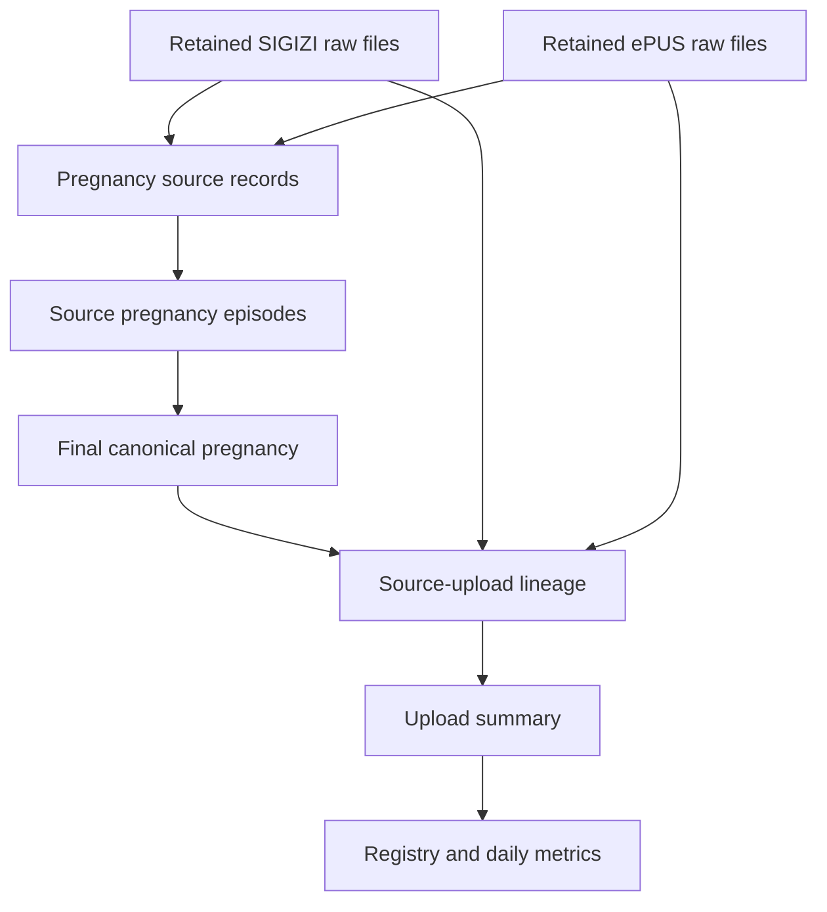

# Purbalingga Pregnancy First-Seen and New-Pregnancy Extension

Project: `stellar-orb-451904-d9`  
Dataset: `kohort_bumil_v2`  
Timezone: `Asia/Jakarta`  
Version convention: `v3_3`

## Plain-language definition

A **new pregnancy** is counted on the date when its final canonical pregnancy episode first becomes observable in any retained pregnancy-creating source file.

This is not necessarily K1 or the first clinical ANC visit. If the first retained record is K3, the pregnancy is new on the upload date of that K3-containing file. Later visits, repeated exports, and later appearances in another system enrich the same canonical pregnancy and do not count it again. A later pregnancy for the same woman remains a separate pregnancy episode and can have its own first-seen date.

> First seen means first observable in retained data history. It is not necessarily the original clinical registration date.

## Data flow

## Which sources may establish first appearance?

Only sources that create pregnancy membership in the Purbalingga canonical-pregnancy pipeline are included.

| System | Source table | Pregnancy creator? | Used for first seen? |
|---|---|---:|---:|
| SIGIZI | `DAFTAR_BUMIL` | Yes | Yes |
| SIGIZI | `KESGA_BUMIL_ANC` | Yes | Yes |
| SIGIZI | `KOHORT_IBU` | Yes | Yes |
| SIGIZI | `KESGA_BUMIL` | Yes | Yes |
| ePUS | `EPUS_ANC` | Yes | Yes |
| ePUS | `EPUS_KUNJUNGAN_IBU_HAMIL` | Yes | Yes |
| SIGIZI | `IBU_NIFAS` | No; outcome/delivery evidence | No |
| ePUS | `EPUS_INC`, `EPUS_PNC` | No; outcome/delivery evidence | No |
| eKohort | Delivery/outcome sources | No | No |
| SIMRS | Delivery/outcome sources | No | No |
| Birth Confirmation | Delivery/outcome source | No | No |

Excluding evidence-only sources prevents a delivery record from creating or backdating the first appearance of a pregnancy.

## Objects, grain, and function

| Object | Type | Grain | Function |
|---|---|---|---|
| `t_pregnancy_source_upload_lineage_v3_3` | Table | One canonical pregnancy × one contributing source record | Connects a final pregnancy to source episode, cleaned record, retained raw history, and timestamp evidence. Includes an explicit unresolved row when no source-record path is recoverable. |
| `t_pregnancy_upload_summary_v3_3` | Table | One canonical pregnancy | Selects the pregnancy-level first/last timestamps, first-seen source, fallbacks, and contributing-record counts. |
| `v_pregnancy_registry_v3_3` | View | One canonical pregnancy | Combines identity, pregnancy state, dating, outcome, geography, lineage summary, and today/7-day/30-day flags. |
| `v_new_pregnancy_metrics_daily_v3_3` | View | One metric date × first-seen source scope | Publishes daily, rolling-seven-day, and rolling-thirty-day distinct pregnancy counts. |

## Lineage logic

1. Start at `t_pregnancy_episode_spine_v3_3`, the final canonical pregnancy table.
2. Expand `canonical_sigizi_episode_ids` and `canonical_epus_episode_ids`.
3. Join to `t_sigizi_pregnancy_episode_v3_3` and `t_epus_pregnancy_episode_adapter_v3_3`.
4. Expand the pregnancy-creating member record arrays.
5. Join the member IDs to `t_sigizi_source_records` or `t_epus_source_records` and retain only `pregnancy_episode_creator_flag = TRUE`.
6. Match source system + source table + stable source record ID back to the earliest retained raw-file history.
7. Collapse repeated raw versions of the same stable source record into one lineage row while keeping the first and last file, upload, ingestion, and observed timestamps.
8. Add an explicit unresolved row if a final pregnancy cannot be traced to any contributing pregnancy-source record.

The stable raw ID uses the first available value from `uuid`, `hash_code`, `id`, or `no`, matching the Purbalingga source-standardization logic. Cleaned rows whose IDs were built from a whole-row fingerprint may not match across repeated exports; these remain visible through the cleaned-row fallback flags.

## Timestamp selection

### Source-record level

For each contributing source record:

1. Earliest upload timestamp parsed from retained raw `file_name`.
2. Raw ingestion timestamp if upload is unavailable.
3. Upload timestamp parsed from the selected cleaned row when raw history cannot be matched.
4. Cleaned-row ingestion timestamp.
5. Cleaned `file_date` at midnight `Asia/Jakarta` as the final timestamp fallback.
6. Explicit unresolved status if none is available.

### Pregnancy level

The pregnancy-level rule is intentionally global:

1. Select the earliest available **upload timestamp anywhere in the pregnancy lineage**.
2. Only if the entire pregnancy has no upload timestamp, select the earliest ingestion timestamp.
3. Only if neither exists, use an auditable cleaned `file_date` fallback.

This means an earlier ingestion timestamp cannot outrank a retained upload timestamp from another contributing record. `pregnancy_first_seen_date` is derived in `Asia/Jakarta`.

Resolution and audit fields distinguish raw-history resolution, cleaned-row fallback, timestamp fallback, ID collisions, and unresolved lineage.

## Worked example: first appearance is K3

Assume one canonical pregnancy has the following retained history:

| Event | File upload | Meaning |
|---|---|---|
| SIGIZI K3 record first appears | 10 March 2026 08:15 WIB | First observable evidence |
| Same SIGIZI record appears in a repeated export | 14 March 2026 09:00 WIB | Enrichment/re-export; not new again |
| ePUS record later matches the pregnancy | 20 March 2026 13:10 WIB | Final source combination becomes SIGIZI + EPUS |

The result is:

- `pregnancy_first_seen_timestamp`: 10 March 2026 08:15 WIB
- `pregnancy_first_seen_source_system`: `SIGIZI`
- Daily new-pregnancy count: one on 10 March only
- Final pregnancy source combination: `SIGIZI + EPUS`
- No additional count on 14 or 20 March

## Metrics

| Metric | Definition |
|---|---|
| `new_pregnancies_daily` | Distinct pregnancies whose `pregnancy_first_seen_date` equals the metric date. |
| `new_pregnancies_rolling_7_days` | Metric date plus the preceding six calendar dates, inclusive. |
| `new_pregnancies_rolling_30_days` | Metric date plus the preceding twenty-nine calendar dates, inclusive. |
| `ALL` scope | Unduplicated count of canonical `pregnancy_episode_id` across all first-seen sources. |
| Source scope | System where the pregnancy first appeared, not the final source combination. |

These metrics never use ANC date, HPHT, HPL, delivery date, or source-row count as the metric date or counting unit.

## Core field dictionary

### Lineage table

| Field | Meaning |
|---|---|
| `pregnancy_episode_id` | Final canonical pregnancy identifier. |
| `source_system`, `source_table` | Contributing pregnancy-creating source family and table. |
| `source_record_key` | System + table + record ID lineage key. |
| `source_record_id` | Source-standardized record identifier. |
| `source_episode_id`, `source_episode_ids` | Representative and complete set of contributing SIGIZI/ePUS preliminary pregnancy episode identifiers. |
| `file_name`, `last_file_name` | First and last retained file names for the stable source record. |
| `record_first_upload_timestamp`, `record_last_upload_timestamp` | First/last timestamps parsed from retained file names. |
| `record_first_ingestion_timestamp`, `record_last_ingestion_timestamp` | First/last warehouse ingestion timestamps. |
| `record_first_seen_timestamp`, `record_last_seen_timestamp` | Selected observation range for the source record. |
| `raw_version_count` | Number of retained raw versions collapsed into the lineage row. |
| `first_seen_resolution_method` | Exact timestamp resolution path. |
| `first_seen_fallback_flag` | True when upload time is unavailable for that record. |
| `cleaned_row_fallback_flag` | True when cleaned source-row history was needed. |
| `source_record_id_collision_flag` | Same selected ID matched more than one table inside the source system. |
| `source_lineage_resolved_flag`, `lineage_status` | Whether and how the source path was resolved. |

### Upload summary and registry

| Field | Meaning |
|---|---|
| `pregnancy_first_upload_timestamp` | Earliest upload timestamp in the pregnancy lineage. |
| `pregnancy_first_ingestion_timestamp` | Earliest ingestion timestamp in the pregnancy lineage. |
| `pregnancy_first_seen_timestamp`, `pregnancy_first_seen_date` | Globally selected upload-first timestamp and Jakarta date. |
| `pregnancy_first_seen_source_system`, `pregnancy_first_seen_source_table` | Source of the selected first appearance. |
| `pregnancy_first_seen_resolution_method` | How the selected first-seen timestamp was resolved. |
| `pregnancy_first_seen_fallback_flag` | True when the selected record did not have upload time. |
| `pregnancy_last_seen_timestamp`, `pregnancy_last_seen_date` | Latest observable retained timestamp. |
| `source_lineage_record_count` / `contributing_source_record_count` | Distinct pregnancy-creating source records. |
| `sigizi_source_record_count`, `epus_source_record_count` | Source-specific contributing record counts. |
| `first_seen_today_flag` | First-seen date equals today in Jakarta. |
| `first_seen_rolling_7_days_flag` | First seen today or in the preceding six dates. |
| `first_seen_rolling_30_days_flag` | First seen today or in the preceding twenty-nine dates. |

## Scheduling and deployment

1. Run PBG-01 through PBG-04 after their respective raw ingestion.
2. Run PBG-05 after PBG-02 and PBG-04 succeed.
3. Run `scheduled/05C_PBG-05C_pregnancy_first_seen.sql` after PBG-05 succeeds. It may run in parallel with the delivery branch because it depends only on canonical pregnancy and pregnancy-source history.
4. Deploy `views_deploy_once/15_v_pregnancy_first_seen.sql` in a **separate BigQuery job** after PBG-05C has created the tables.
5. Do not schedule the view file daily. Re-run it only when view definitions change.
6. Run `utilities/12_validate_pregnancy_first_seen.sql` after deployment and after material logic changes.

The two table objects are built together because they share temporary parsing functions and lineage intermediates. Permanent views are separate because BigQuery does not permit permanent-view definitions to depend on temporary UDFs in the same script session.

## Validation checklist

- Upload summary has one row per canonical pregnancy.
- Registry has one row per canonical pregnancy.
- Every canonical pregnancy is resolved or explicitly classified unresolved.
- Upload and ingestion coverage are reviewed by source system and table.
- Fallback, unresolved, and source-ID collision rows are reviewed separately.
- Repeated exports do not duplicate a source lineage key or create a new pregnancy.
- A later appearance in another source changes enrichment/source combination but not first-seen counting.
- Multiple pregnancy episodes for the same woman remain separate identifiers.
- `ALL` is an unduplicated distinct pregnancy count.
- Daily and rolling metrics are reproducible from `pregnancy_first_seen_date`.

## Limitations

- First seen is bounded by retained raw-file history. Files deleted before retention began cannot be reconstructed.
- A timestamp embedded in `file_name` is treated as upload/export evidence according to local ingestion practice; it is not a clinical encounter timestamp.
- Whole-row fingerprint IDs can change when exported row content changes. These cases may require cleaned-row fallback and should be reviewed using the audit flags.
- The extension measures pregnancy observability in SIGIZI/ePUS pregnancy history. It deliberately excludes delivery-only evidence from establishing first appearance.
