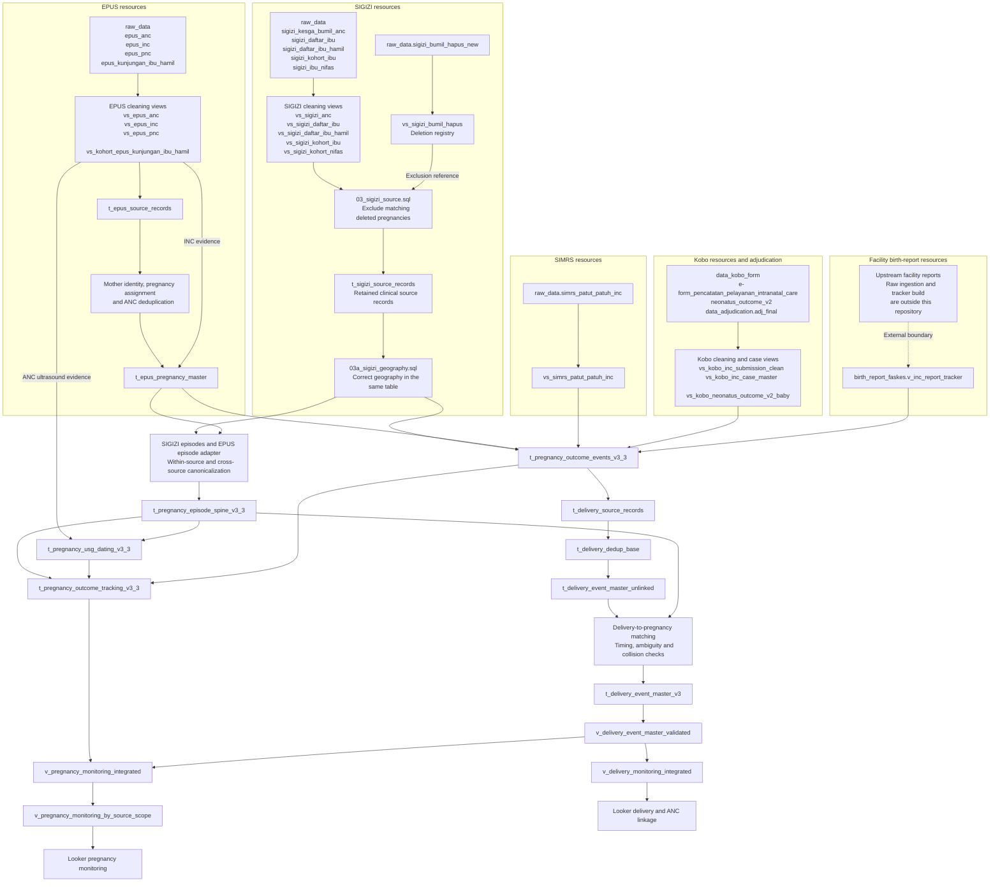

# Data flow and matching overview

This overview contains no population totals or dashboard results. The [Word guide](Lombok_Barat_v3_Data_Flow_and_Matching.docx) gives the detailed rules and exact reporting dependencies.

## Start with the raw-source families

Each outlined group starts at its own source. SIGIZI and EPUS supply pregnancy records **and** outcome evidence. SIMRS, Kobo and facility reports supply outcome evidence that is subsequently matched to pregnancies.

The diagram groups related views and preparation steps; it is not an exhaustive SQL-reference graph. Exact raw-to-view pairs follow below. Unqualified objects belong to `spheres-lombok-barat.kohort_bumil_v3`.

[Open the zoomable vector diagram](diagrams/raw_sources_to_reporting.svg). Editable diagram sources and rendering instructions are in [diagrams](diagrams/README.md). The Word guide splits the same flow into source-family, preparation and core/reporting panels for readability.

**Boundary note:** the dashed facility arrow is contextual, not a verified dependency on a named raw table. The repository consumes the existing tracker view. Bundled source/view boxes do not imply that every listed view reads every listed raw table.

## Raw data to cleaning views

All paths below belong to project `spheres-lombok-barat`. Cleaning views are in `kohort_bumil_v3`.

| Raw source | Cleaning view |
|---|---|
| `raw_data.sigizi_kesga_bumil_anc` | `vs_sigizi_anc` |
| `raw_data.sigizi_daftar_ibu` | `vs_sigizi_daftar_ibu` |
| `raw_data.sigizi_daftar_ibu_hamil` | `vs_sigizi_daftar_ibu_hamil` |
| `raw_data.sigizi_kohort_ibu` | `vs_sigizi_kohort_ibu` |
| `raw_data.sigizi_ibu_nifas` | `vs_sigizi_kohort_nifas` |
| `raw_data.sigizi_bumil_hapus_new` | `vs_sigizi_bumil_hapus` (exclusion reference, not a clinical source) |
| `raw_data.epus_anc` | `vs_epus_anc` |
| `raw_data.epus_inc` | `vs_epus_inc` |
| `raw_data.epus_pnc` | `vs_epus_pnc` |
| `raw_data.epus_kunjungan_ibu_hamil` | `vs_kohort_epus_kunjungan_ibu_hamil` |
| `raw_data.simrs_patut_patuh_inc` | `vs_simrs_patut_patuh_inc` |
| `data_kobo_form.e-form_pencatatan_pelayanan_intranatal_care` | `vs_kobo_inc_submission_clean`, then `vs_kobo_inc_case_master` |
| `data_adjudication.adj_final` | Also contributes to `vs_kobo_inc_case_master` |
| `data_kobo_form.neonatus_outcome_v2` | `vs_kobo_neonatus_outcome_v2_baby` |

Facility birth reports enter through the existing external view `birth_report_faskes.v_inc_report_tracker`. Its own upstream build and ingestion schedules are not included here.

## Preparation to the shared pregnancy spine

The SIGIZI clinical cleaning views are compared with `vs_sigizi_bumil_hapus` inside `03_sigizi_source.sql`. Matching deleted pregnancy records go to `t_sigizi_deletion_exclusion_audit`; nonmatched records are published as `t_sigizi_source_records`. The geography correction updates that same source table, with its audit in `t_sigizi_location_resolved_v1`. Corrected active records become `t_sigizi_pregnancy_episode_v3_3`, then `t_sigizi_pregnancy_episode_canonical_v3_3`.

Deletion matching requires an exact pregnancy anchor plus usable NIK, or exact normalized name and birth date when a NIK is unavailable. Conflicting usable NIKs block the name fallback. Missing matching information does not trigger a mother-wide exclusion. Independent EPUS or hospital evidence remains usable. The audit and reconciliation summary describe the latest refresh, not an append-only history.

See the [deletion flow diagram](diagrams/sigizi_deletion_exclusion.svg) and [deployment guide](../migrations/sigizi_deletion/README.md). Replace the old scheduled source-builder SQL in place; a one-off manual run does not update an existing schedule. The registry view is deployed once and then reads retained raw deletion exports during each source refresh.

EPUS views feed `t_epus_source_records`, then `t_epus_mother_records`, then `t_epus_pregnancy_records`. Canonical ANC visits are stored in `t_epus_anc_canonical_events`. The pregnancy master reads pregnancy-assigned records, canonical ANC events and INC evidence; its output is `t_epus_pregnancy_master`. The independent adapter creates `t_epus_pregnancy_episode_adapter_v3_3`, followed by `t_epus_pregnancy_episode_canonical_v3_3`.

Cross-source pregnancy matching combines the canonical SIGIZI and EPUS episodes into `t_pregnancy_episode_spine_v3_3`. Unmatched episodes are retained. Canonical maps preserve source membership and later merge decisions.

## Pregnancy, delivery and reporting branches

The outcome table receives corrected SIGIZI records, the EPUS master, and SIMRS/Kobo/facility evidence. The pregnancy spine supplies the identity and timing context used for USG matching, pregnancy tracking and delivery-to-ANC linkage.

Delivery deduplication happens before delivery-to-pregnancy linkage. The validated delivery view then feeds both the pregnancy monitoring view and the delivery monitoring view. These are different reporting grains, not interchangeable outputs.

Other reporting views support dating, birth weight, source overlap, capture and reporting timeliness. Their direct inputs are listed in the Word guide. Some read original source evidence as well as core tables.

## What the processing steps mean

**Cleaning** standardizes comparable representations of names, identifiers, dates and phones. Geography correction resolves shifted village/facility fields before they influence episode matching; unresolved geography is not silently filled from potentially shifted raw fields.

**Episode construction** separates pregnancies within a mother using pregnancy dates. Repeated visits do not automatically mean repeated pregnancies, and the same mother can have distinct pregnancy episodes.

**Pregnancy matching** uses deterministic rules: exact cleaned NIK plus compatible pregnancy timing, or supported combinations of name, maternal date of birth, HPHT, HPL, delivery date, geography and phone. Strong rescue rules can handle some conflicting identity fields. Weaker rules guard against conflicting trusted NIKs. Cross-source candidate ranking and final canonicalization retain traceable mappings.

**Delivery deduplication** asks whether reports describe the same delivery. It uses identifier/name/phone/date-of-birth evidence together with compatible delivery dates. Fuzzy names require supporting evidence. A connected group with conflicting trusted NIKs is guarded against an unsafe collapse.

**Delivery-to-ANC linkage** asks which pregnancy belongs to a deduplicated delivery. Direct EPUS source keys, exact NIK, exact or compact name plus date of birth, and phone plus date of birth generate candidates subject to timing and conflict rules. A direct SIGIZI lineage rescue is considered only under its specified conditions. Tied best pregnancy candidates remain ambiguous; competing delivery clusters do not all keep the same accepted pregnancy link.

**Reporting** combines pregnancy tracking with validated delivery evidence. Pregnancy monitoring is based on the selected expected-delivery date; delivery reporting is based on actual delivery events and valid-birth rules. Use the intended source scope, eligibility filter, date dimension and row grain in Looker.

These stages do not all use the same thresholds, tie treatment or acceptance rules. Consult the detailed guide and the corresponding SQL before changing a rule.
