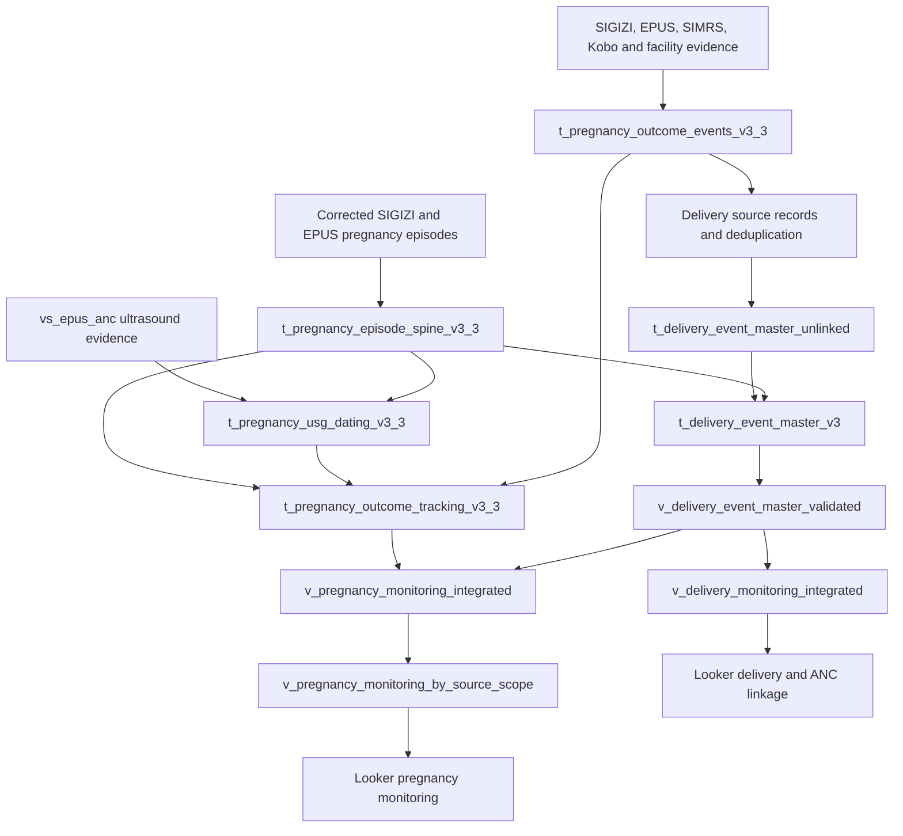

# Data flow and matching overview

This overview contains no population totals or dashboard results. The [Word guide](Lombok_Barat_v3_Data_Flow_and_Matching.docx) gives the detailed rules and exact reporting dependencies.

## Raw data to cleaning views

All paths below belong to project `spheres-lombok-barat`. Cleaning views are in `kohort_bumil_v3`.

| Raw source | Cleaning view |
|---|---|
| `raw_data.sigizi_kesga_bumil_anc` | `vs_sigizi_anc` |
| `raw_data.sigizi_daftar_ibu` | `vs_sigizi_daftar_ibu` |
| `raw_data.sigizi_daftar_ibu_hamil` | `vs_sigizi_daftar_ibu_hamil` |
| `raw_data.sigizi_kohort_ibu` | `vs_sigizi_kohort_ibu` |
| `raw_data.sigizi_ibu_nifas` | `vs_sigizi_kohort_nifas` |
| `raw_data.epus_anc` | `vs_epus_anc` |
| `raw_data.epus_inc` | `vs_epus_inc` |
| `raw_data.epus_pnc` | `vs_epus_pnc` |
| `raw_data.epus_kunjungan_ibu_hamil` | `vs_kohort_epus_kunjungan_ibu_hamil` |
| `raw_data.simrs_patut_patuh_inc` | `vs_simrs_patut_patuh_inc` |
| `data_kobo_form.e-form_pencatatan_pelayanan_intranatal_care` | `vs_kobo_inc_submission_clean`, then `vs_kobo_inc_case_master` |
| `data_adjudication.adj_final` | Also contributes to `vs_kobo_inc_case_master` |
| `data_kobo_form.neonatus_outcome_v2` | `vs_kobo_neonatus_outcome_v2_baby` |

Facility birth reports enter through the existing external view `birth_report_faskes.v_inc_report_tracker`. Its own upstream build and ingestion schedules are not included here.

## Preparation to the shared pregnancy spine

The SIGIZI cleaning views feed `t_sigizi_source_records`. The geography correction updates that same table, with its audit in `t_sigizi_location_resolved_v1`. Corrected records become `t_sigizi_pregnancy_episode_v3_3`, then `t_sigizi_pregnancy_episode_canonical_v3_3`.

EPUS views feed `t_epus_source_records`, then `t_epus_mother_records`, then `t_epus_pregnancy_records`. Canonical ANC visits are stored in `t_epus_anc_canonical_events`. The pregnancy master reads pregnancy-assigned records, canonical ANC events and INC evidence; its output is `t_epus_pregnancy_master`. The independent adapter creates `t_epus_pregnancy_episode_adapter_v3_3`, followed by `t_epus_pregnancy_episode_canonical_v3_3`.

Cross-source pregnancy matching combines the canonical SIGIZI and EPUS episodes into `t_pregnancy_episode_spine_v3_3`. Unmatched episodes are retained. Canonical maps preserve source membership and later merge decisions.

## Pregnancy, delivery and reporting branches

This diagram groups source preparation; it shows the main branch relationship, not every direct SQL reference.

Other reporting views support dating, birth weight, source overlap, capture and reporting timeliness. Their direct inputs are listed in the Word guide. Some read original source evidence as well as core tables.

## What the processing steps mean

**Cleaning** standardizes comparable representations of names, identifiers, dates and phones. Geography correction resolves shifted village/facility fields before they influence episode matching; unresolved geography is not silently filled from potentially shifted raw fields.

**Episode construction** separates pregnancies within a mother using pregnancy dates. Repeated visits do not automatically mean repeated pregnancies, and the same mother can have distinct pregnancy episodes.

**Pregnancy matching** uses deterministic rules: exact cleaned NIK plus compatible pregnancy timing, or supported combinations of name, maternal date of birth, HPHT, HPL, delivery date, geography and phone. Strong rescue rules can handle some conflicting identity fields. Weaker rules guard against conflicting trusted NIKs. Cross-source candidate ranking and final canonicalization retain traceable mappings.

**Delivery deduplication** asks whether reports describe the same delivery. It uses identifier/name/phone/date-of-birth evidence together with compatible delivery dates. Fuzzy names require supporting evidence. A connected group with conflicting trusted NIKs is guarded against an unsafe collapse.

**Delivery-to-ANC linkage** asks which pregnancy belongs to a deduplicated delivery. Direct EPUS source keys, exact NIK, exact or compact name plus date of birth, and phone plus date of birth generate candidates subject to timing and conflict rules. A direct SIGIZI lineage rescue is considered only under its specified conditions. Tied best pregnancy candidates remain ambiguous; competing delivery clusters do not all keep the same accepted pregnancy link.

**Reporting** combines pregnancy tracking with validated delivery evidence. Pregnancy monitoring is based on the selected expected-delivery date; delivery reporting is based on actual delivery events and valid-birth rules. Use the intended source scope, eligibility filter, date dimension and row grain in Looker.

These stages do not all use the same thresholds, tie treatment or acceptance rules. Consult the detailed guide and the corresponding SQL before changing a rule.
